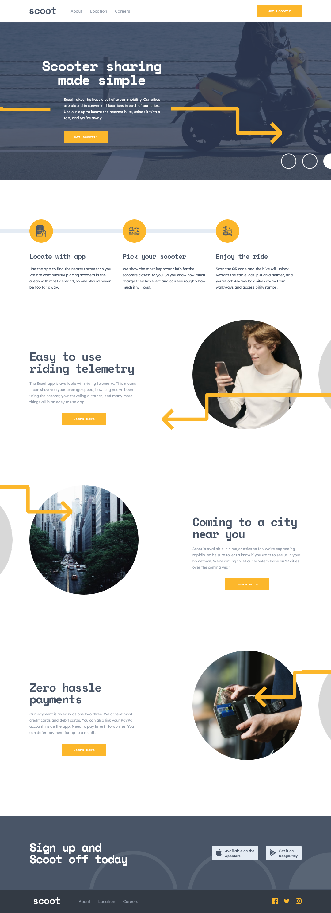

# Scoot Solo Project

project live at: [https://scoot-solo.vercel.app/](https://scoot-solo.vercel.app/)

## Overview

Scoot Solo is a web application designed to provide a seamless scooter-sharing experience. The project includes various components such as a homepage, about page, locations page, and careers page. The application is built using HTML, CSS, SCSS, and JavaScript.


## Screenshot



## Usage

- **Homepage**: Provides an overview of the scooter-sharing service.
- **About Page**: Details about the company and its mission.
- **Locations Page**: Information about the locations where the service is available.
- **Careers Page**: Lists job openings and allows users to apply.

## Development

### CSS and SCSS

The project uses SCSS for styling. Each page has its own CSS file, such as `about.css`, `careers.css`, and `locations.css`. The main styles are defined in a dedicated `file.scss` file, which imports the other SCSS files. The `helpers-css` directory contains the `normalize.css` file, which resets the default browser styles, and the `variables.scss` file, which defines the color variables and typography used throughout the project.

### JavaScript

The main JavaScript functionality is handled in `script.js` and `about/script.js`. These scripts manage the interactive elements of the application, such as the hamburger menu and FAQ sections.

## Project Structure

The project is organized into the following directories and files:

```
scoot solo/
├── about/
│   ├── about.css
│   ├── about.html
│   └── script.js
├── careers/
│   ├── careers.css
│   ├── careers.html
│   └── careers.scss
├── components/
│   ├── content-row.scss
│   ├── header.css
│   ├── header.scss
│   ├── small-heading.css
│   ├── small-heading.scss
│   └── value-list.scss
├── helpers-css/
│   ├── normalize.css
│   ├── normalize.scss
│   └── variables.scss
├── locations/
│   ├── location.css
│   ├── location.html
│   └── location.scss
├── ressources/
│   ├── apple-icon.svg
│   ├── background-circles-desktop.png
│   ├── background-circles-mobile.png
│   ├── cross.png
│   ├── google-icon.png
│   ├── hamburger.png
│   ├── heading-circles.png
│   ├── hero-background.png
│   ├── image-phone-girl.png
│   ├── logo-dark.png
│   ├── logo-light.png
│   ├── map-desktop.png
│   ├── map-mobile.png
│   ├── phone-icon.png
│   ├── scooter-img.png
│   └── small-arrow-down.png
├── index.html
├── script.js
├── style.css
└── style.scss
```
## License

This project is licensed under the MIT License.

## Contact

For any inquiries or questions, please contact me at my Discord: `.meowsky`
